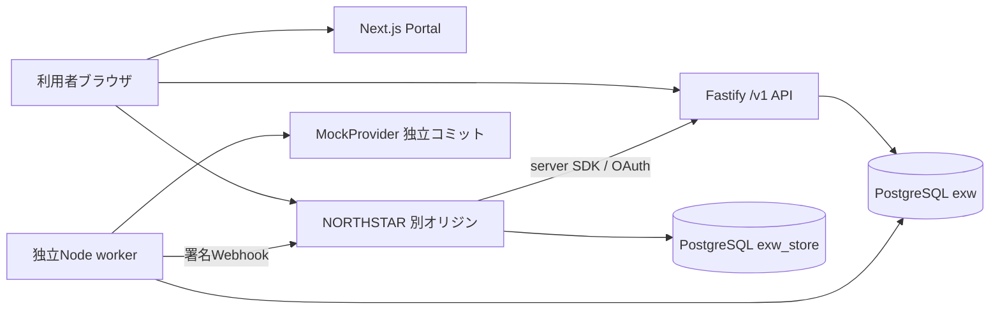

# 構成と信頼境界

PortalはDBへ直接接続しない。CookieとCSRFトークンでAPIを呼ぶ。利用者セッションと加盟店アクセストークンは別認証で、加盟店トークンから利用者承認へアクセスできない。

APIはworkspaceを認証済みセッションまたはアクセストークンから決める。ブラウザからworkspace IDを指定しても認可境界は変わらない。全業務テーブルはworkspaceとgenerationを持ち、主要関連には複合外部キーを置く。

金融操作はworkspace行をロックし、さらに勘定をID順にロックする。これはデモ向けの保守的な直列化であり、高TPSを目的とする設計ではない。状態更新・台帳・冪等性結果・outboxを同一トランザクションで確定する。

外部プロバイダー呼出し中にトランザクションを開かない。先にintentとjobをコミットし、独立workerが外部結果を取得して新しいトランザクションで反映する。模擬プロバイダーの結果も別コミットとして保存し、業務側停止からの回復を検証する。

ECは別DBと権限を使用する。Composeのinit SQLは `exw_store` をNOSUPERUSERにし、exw DBへのCONNECTを許可しない（Compose起動とrole分離はLinux環境でPostgreSQL 18.6により確認済み、`verify:clean` でも42501を検証）。ECコードはExPressテーブルを参照せず、サーバーSDK・公開API・署名Webhookだけを使う。

運営者は `/v1/admin/timeline/{id}` で注文→承認→オーソリ→capture→仕訳明細→Webhook配信→返金を追跡し、`/v1/admin/journals` で仕訳を検索し、失敗ジョブ・dead-letter配信を理由付きで再試行できる。

## 配備案

公開向けの具体的な手順・ファイル（`scripts/tunnel.ts`、`Dockerfile`、`render.yaml`）は [deploy.md](deploy.md) にある。公開ホスト名の多くは Public Suffix List に載るため、Portal は `/api/*` と `/docs` を `API_INTERNAL_URL` へ同一オリジンで転送し（`API_URL=<PORTAL_URL>/api`）、ECへの引き渡しはトップレベル遷移 `GET /connect?code=`（一度限り・5分失効）で行う。これで Cookie は常にファーストパーティで、公開ホスト名は Portal と EC の2つで足りる。`WORKER_IN_API=true` は無料枠に常駐 worker がないホスト向けの選択肢で、既定は独立 worker プロセス。

TLS終端リバースプロキシの背後に、Portal、API、ECを別サービスとして置く。PostgreSQLは外部非公開ネットワークへ配置し、workerは常駐プロセスか永続ジョブ基盤で実行する。workerのプロセス監視・再起動・ログ保持・DBバックアップが必要。Nextだけの静的配信では動作しない。

公開前には独立した秘密管理、DB最小権限ロール、TLS、秘密鍵更新の運用、workspace保存期間、レート制限共有ストア、負荷試験を確認する。現リポジトリはローカルデモの実装で、実資金を運用する決済事業者の基盤として提供するものではない。
