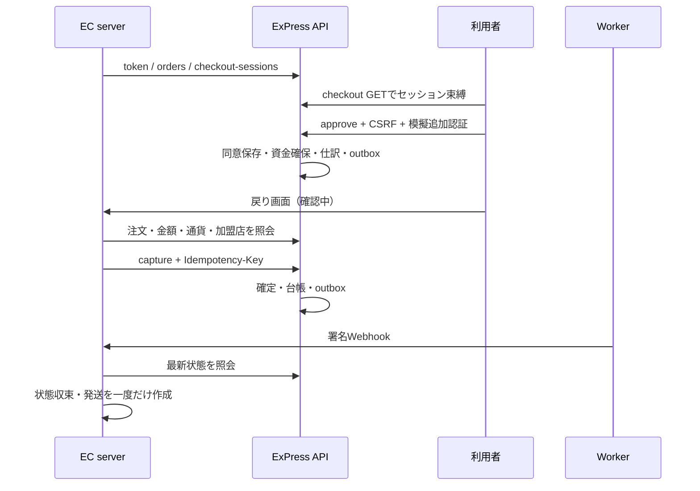

# 決済ライフサイクル

EC注文、PaymentOrder、CheckoutSession、Authorization、Capture、Refund、ProviderAttemptはそれぞれ別レコード・別責務を持つ。

- CheckoutSession: created → approved / cancelled / expired。初期30分。
- Authorization: pending → authorized / failed。authorized → partially_captured / captured / voided / expired。初期24時間。
- Capture / Refund: pending → succeeded / failed。
- ProviderAttempt: created → pending / unknown / succeeded / failed。unknown中は新規資金移動を作らず照会。
- Payout: requested → processing → succeeded / failed。申請で残高を確保し、workerが外部試行を開始するとprocessingになる。
- Subscription: pending_consent → active → past_due / paused / cancelled。

承認は利用者同意、オーソリは資金確保。承認時に支払先・金額・JPY・利用者・支払元を固定する。増額用のAPIは設けず、新しい注文・承認を要求する。

複数部分captureを許可し、`captured + reserved + released <= amount` をDB制約でも確認。カードcaptureが処理中の間、追加のcapture/voidはPROVIDER_PENDINGとして照会を要求する。`final_capture=true` は成功後に未使用額を解放する。部分確定後のvoid/expireは未確定分だけを返す。PaymentOrderの要約には確定額を残し、単純に未決済へ戻さない。

返金はcaptureごとに `refunded + reserved <= amount`。処理中の返金も予約額へ含める。返金に使った未精算ロットは精算ジョブが再び利用可能へ移さない。失敗なら同じ原資に戻す。

運営者の `/v1/admin/timeline/{id}` は、これらの状態遷移を注文単位でチェックアウト・オーソリ・capture・返金・provider attempt・outboxイベント・Webhook配信・仕訳明細・精算ロット・案件・請求周期として並べる。

workspace/generationを確認する行ロックがcapture/void/expireとresetの競合を直列化する。プロバイダー成功後、業務反映前に停止してもprovider結果照会で同じintentを回復する。新しい冪等キーでも業務側上限を超えられない。

月次請求はUTC。初回同意日のanchor dayを保持し、月末を超えた月は末日に丸める。周期ごとに一意制約を持ち、1日後・3日後に同じ周期を再試行。最大3回失敗で停止。同意撤回後は新しい請求を作らず、すでに外部へ送ったintentは結果照会を完了させる。

カードの確保後にcan_captureが制限された場合、そのオーソリを解放し、同じ請求周期の失敗として再試行を待つ。一つの購読の失敗で精算やoutbox処理を巻き戻し続けない。カードの結果不明中は、新しい請求試行を作らない。
